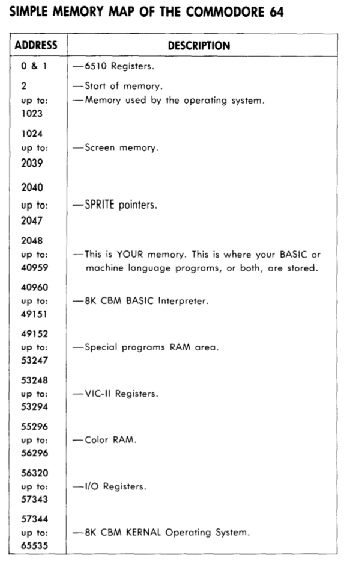

class: branded

# The Sound of Rust

.speaker[
Antoine van Gelder<br/>
https://flowdsp.io<br/>
CTFP 2019
]

.dedication[In loving memory of my father, Antoine Leonard van Gelder Snr.]

---

class: center, middle

## A Song of Rust and Wire

.normal[]

---


class: center, middle

.small[]

---

## Functional programming

> *Object oriented programming makes code understandable by encapsulating moving parts. Functional programming makes code understandable by minimizing moving parts.*
>
> -- Michael Feathers @ http://r7krecon.com

---

class: center, middle

.small[]


---

### Continuous Domain

$$ y\left(t\right) = A  \sin(\omega t + \varphi) $$

--

where

$$ \begin{align}
A       & = 1                   \\ & \text{amplitude}         \\\\
\varphi & = 0                   \\ & \text{phase offset}      \\\\
\omega  & = 2  \pi  f \\ & \text{angular frequency} \\\\
f       & = 261.6Hz             \\ & \text{middle c}
\end{align} $$

---

### Continuous Domain

$$ y\left(t\right) = A  \sin(\omega t + \varphi) $$

.center.small[]

---

### Discrete Domain

$$ y\left[t\right] = A \sin(\omega t + \varphi) $$

--

where

$$ \begin{align}
A       & = 1                    \\ & \text{amplitude}         \\\\
\varphi & = 0                    \\ & \text{phase offset}      \\\\
\omega  & = 2  \pi \delta \\ & \text{angular frequency} \\\\
\delta  & = \frac{f}{fs}         \\ & \text{rate of change}    \\\\
f       & = 261.6Hz              \\ & \text{middle c}          \\\\
fs      & = 44.1KHz              \\ & \text{sampling rate}
\end{align} $$


---

### Implementation Domain (C language)

```c
void audio_callback(float* y, size_t length, float fs, size_t t) {
    float dx = 261.6 / fs;  // 261.6 Hz = Middle-C
    float w = 2. * PI * dx;

    for (size_t index = 0; index < length; index++) {
        float t = (float)(index + t);
        y[index] = sinf(w * t);
    }
}
```

---

### Rust

```rust
fn audio_callback(y: &mut [f32; 32], fs: f32, t: usize) -> () {
    let dx = 261.6 / fs;  // 261.6 Hz = Middle-C
    let w = 2. * core::f32::consts::PI * dx;

    for index in 0..y.len() {
        let t = (index + t) as f32;
        y[index] = f32::sin(w * t);
    }
}
```

---

### Functional Decomposition

```rust
fn signal<S>(fs: f32, t: usize, tn: usize) -> Vec<f32, S>
where S: ArrayLength<f32>
{
    let dx = 261.6 / fs;  // 261.6 Hz = Middle-C
    let w = 2. * core::f32::consts::PI * dx;

    (t..tn).map(|t| f32::sin(t as f32 * w)).collect()
}
```

---

### Interlude: Functors

</img>

---

### Functional Decomposition

```rust
let dx = 261.6 / fs;  // 261.6 Hz = Middle-C
let w = 2. * core::f32::consts::PI * dx;
```

--

```rust
let y = |t| f32::sin(w * t);
```

--

$$ y\left[t\right] = \sin(\omega t) $$

--

```rust
let ys = signal(t, tn, y);
```

--

```rust
fn signal<F, S>(t: usize, tn: usize, f: F) -> Vec<f32, S>
where F: Fn(usize) -> f32,
      S: ArrayLength<f32>
{
    (t..tn).map(|t|
        f(t as f32)
    ).collect()
}
```

---

### Functional Composition

$$ \begin{align}
y_a\left[t\right] & = \sin(\omega t) \\\\
y_b\left[t\right] & = \sin(2 \omega t)
\end{align} $$

---

### Functional Composition


$$ \begin{align}
y\_a\left[t\right] & = \sin(\omega t) \\\\
y\_b\left[t\right] & = \sin(2 \omega t) \\\\
y\_{mix}           & = \frac{y\_a + y\_b}{2}
\end{align} $$

--

```rust
let y_a = |t| A * trig::sin(w * t);
let y_b = |t| A * trig::sin(2 * w * t);
```

--

```rust
let y_mix = mix(y_a, y_b);
```

--


```rust
fn mix<Fa, Fb>(fa: Fa, fb: Fb) -> impl Fn(f32) -> f32
where Fa: Fn(f32) -> f32,
      Fb: Fn(f32) -> f32,
{
    move |t| (fa(t) + fb(t)) * 0.5
}
```

--

```rust
let y_mix = |t| (y_a(t) + y_b(t)) * 0.5;
```


---

## Interlude: Inevitable Haskell

.big[]

---

### Pattern match and guards

.float-left[
```haskell
factorial :: Integer -> Integer
factorial 0 = 1
factorial n = n * factorial (n - 1)
```
]

.float-right[
```rust
fn factorial(number: i64) -> i64 {
    match number {
        0 => 1,
        x => x * factorial(x - 1),
    }
}
```
]

---

### Recursion with side effects

.float-left[
```haskell
collatz :: Integer -> IO ()
collatz n = do
    let v = case n `mod` 2 of
            0 -> n `div` 2
            _ -> 3 * n + 1

    putStrLn $ show v
    when (v /= 1) $ collatz v
```
]

.float-right[
```rust
fn collatz(n: i32) -> () {
    let v = match n % 2 {
        0 => n / 2,
        _ => 3 * n + 1
    };
    println!("{}", v);
    if v != 1 { collatz(v) }
}
```
]

---

### Record types, expressions and field access

.float-left[
```haskell
data Point = Point {
   x :: Int,
   y :: Int
}

v = Point {x = 1, y = 2}
s = (x v) + (y v)
```
]

.float-right[
```rust
struct Point {
  x : int,
  y : int
}

let v = Point {x:1, y:2};
let s = v.x + v.y;
```
]

---

### Free type parameters

.float-left[
```haskell
type Pair a b = (a, b)
```
]

.float-right[
```rust
type Pair<a,b> = (a,b)
```
]


--

.float-left[
```haskell
id :: t -> t
id x = x
```
]

.float-right[
```rust
fn id<t>(x : t) -> t {
    x
}
```
]

--

.float-left[
```haskell
add3 :: Num t => t -> t -> t -> t
add3 a b c = a + b + c
```
]

.float-right[
```rust
fn add3<T:Num>(a:T, b:T, c:T)->T{
   a + b + c
}
```
]

---

### Algebraic Data Types

.float-left[
```haskell
data Maybe a =
    Nothing
  | Just a

{- x : Maybe t -}
case x of
   Nothing -> False
   Just _ -> True
```
]

.float-right[
```rust
enum Option<T> {
   None,
   Some(T)
}

// x : Option<t>
match x {
  None    => false,
  Some(_) => true
}
```
]

---

### Lambda expressions and higher-order functions

.float-left[
```haskell
ff :: ((int,int)->int, int) -> int
ff (f, x) =
   f (x, x)

m2 :: Int -> Int
m2 n =
   ff ((\(x,y) -> x + y), n)
```
]

.float-right[
```rust
// ||int,int| -> int, int| -> int
fn ff(f:|int,int|->int, x:int) -> int {
    f (x, x)
}

// m2 : |int| -> int
fn m2(n : int) -> int {
    ff ((|x,y| { x + y }), n)
}
```
]

---

### Type classes

.float-left[
```haskell
class Testable a where
    test :: a -> Bool

instance Testable Int where
    test n =
       if n == 0 then False
       else True

hello :: Int -> Bool
hello x =
    test x
```
]

.float-right[
```rust
trait Testable {
    fn test(&self) -> bool
}

impl Testable for int {
    fn test(&self) -> bool {
       if *self == 0 { false }
       else { true }
    }
}

fn hello(x:int) -> bool {
   x.test()
}
```
]


---

### Recursive data structures

.float-left[
```haskell
data Lst t =
    Nil
  | Cons t (Lst t)

let len l =
  case l of
    Nil -> 0
    Cons _ x -> 1 + len x
```
]

.float-right[
```rust
enum Lst<t> {
   Nil,
   Cons(t, Box<Lst<t>>)
}

fn len<t>(l : &Lst<t>) -> uint {
   match *l {
     Nil => 0,
     Cons(_, ref x) => 1 + len(*x)
   }
}
```
]

---

## Safety


---

## Safety: Two Ideas

1. Linear types
  * Gavin Bierman, Valeria de Paiva, Martin Hyland and Nick Benton, A Term Calculus for Intuitionistic Linear Logic, Proc. TLCA, 1993

2. Region-based memory management
  * Mads Tofte and Jean-Pierre Talpin, Implementation of the typed call-by-value λ-calculus using a stack of regions, Proc. PoPL, 1994

--

* Prevents iterator invalidation with borrowing
* Prevents use after free and dangling pointers with lifetimes and borrowing
* Prevents all data races with ownership rules
* Prevents double free with scope deallocation
* Prevents overwriting variables with immutability by default
* Prevents most memory leaks by freeing bound resources after scope
--

* Allows memory arrays without buffer overflow attacks
* Allows manual memory management without segfaults
* Allows threads without data races

---

### Linear Types

Ensure objects are used exactly once, allowing the system to safely deallocate an object after its use.

> #### Ownership
> 1. Each value in Rust has a variable that is called its owner
> 2. There can only be one owner at a time
> 3. When the owner goes out of scope, the value will be dropped
>
> #### References
> 1. At any given time, you can have one and only one mutable reference
> 2. You van have any number of immutable references


---

### Linear types

```rust
let mut xs = vec![0, 1, 2, 3];
let ys = & vec![4, 5, 6, 7];
xs.extend_from_slice(ys);
println!("{:?}", xs) //  [0, 1, 2, 3, 4, 5, 6, 7]
```

--

```rust
let mut xs = vec![0, 1, 2, 3];
let ys = & xs;
xs.extend_from_slice(ys);
println!("{:?}", xs) // ?
```
--

```rust
error[E0502]: cannot borrow `xs` as mutable because it is also borrowed as immutable
  --> src/main.rs:16:5
   |
15 |     let ys = & xs;
   |              ---- immutable borrow occurs here
16 |     xs.extend_from_slice(ys);
   |     ^^^-----------------^^^^
   |     |  |
   |     |  immutable borrow later used by call
   |     mutable borrow occurs here
```

---

### Region-based memory management

```rust
fn f(x: &mut &String) {
    let y = String::from("y");
    *x = &y;
}

fn main () {
    let x = String::from("x");   // x = "x"
    f(&mut &x);                  // x = "y" ???
}
```

--

```rust
error[E0597]: `y` does not live long enough
  --> src/main.rs:14:10
   |
12 | fn f(x: &mut &String) {
   |              - let's call the lifetime of this reference `'1`
13 |     let y = String::from("y");
14 |     *x = &y;
   |     -----^^
   |     |    |
   |     |    borrowed value does not live long enough
   |     assignment requires that `y` is borrowed for `'1`
15 | }
   | - `y` dropped here while still borrowed
```

---

## Performance

> *In certain contexts -- for example the context Rust is targeting -- being 10x or even 2x faster than the competition is a make-or-break thing. It decides the fate of a system in the market, as much as it would in the hardware market.*
>
> -- Graydon Hoare

---

### When performance (is the only thing that) matters

How to write blazingly fast code in any programming language:

--
1. measurement

--
1. data access

--
1. algorithms

--
1. cpu cache performance

--
1. abstractions

--
1. loop optimization
  - algorithm
  - math
  - unroll
  - offload to C or inline assembler
  - vectorization

--
1. parallelization: shared memory, distributed

--
1. moore's law

--

<h2>performance is ALWAYS context dependent</h2>

---

### Performance: Duff's Device

```c
int count = 32;
register short *to, *from;

do {
    *to = *from++;
} while(--count > 0);
```

--

```assembler
    mov     DWORD PTR [rbp-20], 32   // count = 32
.L3:
    mov     rax, rbx                 // *to = *from++;
    lea     rbx, [rax+2]             // .
    movzx   eax, WORD PTR [rax]      // .
    mov     WORD PTR [r12], ax       // .
    sub     DWORD PTR [rbp-20], 1    // --count
    cmp     DWORD PTR [rbp-20], 0    // is count > 0 ?
    setg    al                       // set if count > 0
    test    al, al                   // test if true
    je      .L4                      // it is false, jump to end
    jmp     .L3                      // it is true, jump to top
.L4:                                 // fin
```

---

### Performance: Duff's Device

```c
register n = count / 4;          /* count is divisible by 4 */

do {
    *to = *from++;
    *to = *from++;
    *to = *from++;
    *to = *from++;
} while (--n > 0);
```

---

### Performance: Duff's Device

```c
register n = (count + 3) / 4;    /* count is divisible by any number */

switch (count % 4) {
    case 0: do { *to = *from++;
    case 3:      *to = *from++;
    case 2:      *to = *from++;
    case 1:      *to = *from++;
            } while (--n > 0);
}
```

--

.center.small[]


---

### Performance: Rust

* Rust vs C vs C++ with straight-forward imperative code: +/- 10%
--

* Functional vs Imperative: It depends!

--

What depends?

* Do I have the choice?
--

* Do I need deterministic behavior?

---

## System Programming

> *An operating system is a collection of things that don't fit into a language. There shouldn't be one.*
>
> -- Dan Ingalls, in an article in Byte Magazine, 1981.

<div>&nbsp;</div>

--

.center.small[]

---

### System Programming

* Bare-metal / Embedded systems
* Compilers / Linkers / Interpreters
* Operating systems
* Device drivers

--
Also:

* System libraries
* Shell utilities
* Performance-critical applications

---

.scroll[
</img>
]

---

### Move this thing from that thing to the other thing

.center.big[]

---

### Main and its loop

.center.big[]

---

### Main and its loop

```rust
#![no_std]
#![no_main]

#[entry]
fn main() -> ! {
    let mut cp = cortex_m::Peripherals::take().unwrap();
    let dp = stm32f303::Peripherals::take().unwrap();

    // initialize peripherals
    init_tim2(&dp);
    init_dac1(&dp);
    init_dma2(&mut cp, &dp);

    // enable DMA to start transfer
    let dma2 = &dp.DMA2;
    dma2.ccr3.modify(|_, w| w.en().enabled());

    // enter main loop
    loop {
        cortex_m::asm::wfi(); // wait for interrupt
    }
}
```

---

### Interlude: Portability

```rust
// Linux, macOS, Windows
fn main() {
    let mut synth = synth::Synth::new();

    let mut stream = audio.open_non_blocking_stream(settings, move |args| {
        let portaudio::stream::OutputCallbackArgs { buffer, frames, flags, time } = args;

        synth.audio_callback(&mut buffer);

        portaudio::Continue
    }).unwrap();

    stream.start().unwrap();

    loop {
        thread::sleep(time::Duration::from_millis(10));
    }
}
```

---

### Interlude: Portability

```rust
// VST Plugin for Linux, macOS, Windows
struct SynthPlugin {
    midi: Option<midi::Parser>,
    synth: Option<synth::Synth>,
}

impl Default for SynthPlugin {
    fn default() -> SynthPlugin {
        SynthPlugin {
            midi: Some(midi::Parser::new(midi_callback)),
            synth: Some(synth::Synth::new()),
        }
    }
}

impl Plugin for SynthPlugin {
    fn process(&mut self, buffer: &mut AudioBuffer<f32>) {
        self.synth.as_mut().unwrap().audio_callback(&mut buffer);
    }
}
```

---

### Interlude: Portability

```ecmascript
// WASM
function start() {
    let synth = Synth.new();
    let context = new AudioContext();

    let node = context.createScriptProcessor(synth.block_length, 0, 1);

    node.onaudioprocess = function (event) {
        let buffer = event.outputBuffer.getChannelData(0);
        synth.audio_callback(buffer);
    };

    node.connect(context.destination);
}
```

---

### Peripherals and their registers

.center.big[]

---

### Peripherals and their registers

.float-left[
```basic
10 J = PEEK(56321) // read joystick
20 POKE 53280, J   // set screen colour
30 GOTO 10
RUN
```
]

.float-right[
.normal[]
]

---

</img>

---

.float-left[
.big[]
]

.float-right[
.big[]
]


---

### Direct register access

.small[]

```c
#define RCC_APB1ENR ((uint32_t)0x40021000)

*(RCC_APB1ENR + 0x1c) |= 1;
```

---

### Safe register access

```c
static void TIM_Config(void)
{
  TIM_TimeBaseInitTypeDef    TIM_TimeBaseStructure;

  /* TIM2 Periph clock enable */
  RCC_APB1PeriphClockCmd(RCC_APB1Periph_TIM2, ENABLE);

  /* Time base configuration */
  TIM_TimeBaseStructInit(&TIM_TimeBaseStructure);
  TIM_TimeBaseStructure.TIM_Period = 0x1F;
  TIM_TimeBaseStructure.TIM_Prescaler = 0x0;
  TIM_TimeBaseStructure.TIM_ClockDivision = 0x0;
  TIM_TimeBaseStructure.TIM_CounterMode = TIM_CounterMode_Up;
  TIM_TimeBaseInit(TIM2, &TIM_TimeBaseStructure);

  /* TIM2 TRGO selection */
  TIM_SelectOutputTrigger(TIM2, TIM_TRGOSource_Update);

  /* TIM2 enable counter */
  TIM_Cmd(TIM2, ENABLE);
}
```

---

### svd2rust

.float-left[
.small[```xml
...
<peripheral>
    <name>TIM2</name>
    <description>General purpose timer</description>
    <groupName>TIMs</groupName>
    <baseAddress>0x40000000</baseAddress>
    <addressBlock>
        <offset>0x0</offset>
        <size>0x400</size>
        <usage>registers</usage>
    </addressBlock>
    <interrupt>
        <name>TIM2</name>
        <description>TIM2 global interrupt</description>
        <value>28</value>
    </interrupt>
    <registers>
        <register>
            <name>CR1</name>
            <displayName>CR1</displayName>
            <description>control register 1</description>
            <addressOffset>0x0</addressOffset>
            <size>0x20</size>
            <access>read-write</access>
            <resetValue>0x0000</resetValue>
            <fields>
                <field>
                    <name>CEN</name>
                    <description>Counter enable</description>
                    <bitOffset>0</bitOffset>
                    <bitWidth>1</bitWidth>
                </field>
                <field>
                    <name>UDIS</name>
                    <description>Update disable</description>
                    <bitOffset>1</bitOffset>
                    <bitWidth>1</bitWidth>
                </field>
                ...
```]
]

--

.float-right[
.small[```rust
pub struct R {
    bits: u32,
}
pub struct W {
    bits: u32,
}
impl super::CR1 {
    pub fn modify<F>(&self, f: F)
    where
        for<'w> F: FnOnce(&R, &'w mut W) -> &'w mut W,
    {
        let bits = self.register.get();
        let r = R { bits: bits };
        let mut w = W { bits: bits };
        f(&r, &mut w);
        self.register.set(w.bits);
    }
    pub fn read(&self) -> R {
        R {
            bits: self.register.get(),
        }
    }
    pub fn write<F>(&self, f: F)
    where
        F: FnOnce(&mut W) -> &mut W,
    {
        let mut w = W::reset_value();
        f(&mut w);
        self.register.set(w.bits);
    }
    pub fn reset(&self) {
        self.write(|w| w)
    }
}
pub struct CENR {
    bits: bool,
}
...
```]
]

---

### Safe, direct register access


```rust
const FS: f32 = 32_000.;

pub fn init_tim2(dp: &stm32f303::Peripherals) {
    // enable TIM2 clock
    let rcc = &dp.RCC;
    rcc.apb1enr.modify(|_, w| w.tim2en().set_bit());

    // calculate timer frequency
    let sysclk = 8_000_000; // the stmf32f3 discovery board CPU runs at 8Mhz by default
    let arr = sysclk / FS;  // value to use for auto reload register (arr)

    // configure TIM2
    let tim2 = &dp.TIM2;
    tim2.arr.write(|w| w.arr().bits(arr));      // timer period (sysclk / fs)
    tim2.cr2.write(|w| w.mms().update());       // trigger interrupt when counter reaches arr value
    tim2.cr1.modify(|_, w| w.cen().enabled());  // enable TIM2
}
```

---

### Direct Memory Access controllers

.center.big[]

---

### Direct Memory Access controllers

```rust
static mut DMA_BUFFER: [u32; 64] = [0; 64];

pub fn init_dma2(cp: &mut cortex_m::peripheral::Peripherals, dp: &stm32f303::Peripherals) {
    // enable DMA2 clock
    let rcc = &dp.RCC;
    rcc.ahbenr.modify(|_, w| w.dma2en().set_bit());

    // dma parameters
    let ma = unsafe { DMA_BUFFER.as_ptr() } as usize as u32;
    let pa = 0x40007420; // Dual DAC 12-bit right-aligned data holding register (DHR12RD)
    let ndt = DMA_BUFFER.len() as u16;

    // configure registers for DMA2 channel 3
    let dma2 = &dp.DMA2;
    dma2.cmar3.write(|w| w.ma().bits(ma));     // source memory address
    dma2.cpar3.write(|w| w.pa().bits(pa));     // destination peripheral address
    dma2.cndtr3.write(|w| w.ndt().bits(ndt));  // number of items to transfer

    ...
```

---

### Direct Memory Access controllers

```rust
    ...

    dma2.ccr3.write(|w| {
        w.dir().from_memory()   // source is memory
         .mem2mem().disabled()  // disable memory to memory transfer
         .minc().enabled()      // increment memory address every transfer
         .pinc().disabled()     // don't increment peripheral address every transfer
         .msize().bit32()       // memory word size is 32 bits
         .psize().bit32()       // peripheral word size is 32 bits
         .circ().enabled()      // dma mode is circular
         .pl().high()           // set dma priority to high
         .teie().enabled()      // trigger an interrupt if an error occurs
         .tcie().enabled()      // trigger an interrupt when transfer is complete
         .htie().enabled()      // trigger an interrupt when half the transfer is complete
    });

    ...
```

---

### Direct Memory Access controllers

```rust
    ...

    // enable DMA interrupt
    let nvic = &mut cp.NVIC;
    nvic.enable(stm32f303::Interrupt::DMA2_CH3);

    // enable DMA transfers for DAC
    let dac = &dp.DAC;
    dac.cr.modify(|_, w| w.dmaen1().enabled());
}
```

---

### Interrupts and their handlers

.center.big[]

---

### Interrupts and their handlers

```rust
static mut FS_CLOCK: usize = 0;

#[interrupt]
fn DMA2_CH3() {
   enum State { HT, TC, Error, Unknown };

    // determine dma state
    let dma2 = unsafe { &(*stm32f303::DMA2::ptr()) };
    let isr = dma2.isr.read();

    let state = if isr.tcif3().is_complete() {
        dma2.ifcr.write(|w| w.ctcif3().clear());
        State::TC
    } else if isr.htif3().is_half() {
        dma2.ifcr.write(|w| w.chtif3().clear());
        State::HT
    } else if isr.teif3().is_error() {
        dma2.ifcr.write(|w| w.cteif3().clear());
        State::Error
    } else {
        State::Unknown
    };

    ...
```

---

### Interrupts and their handlers

```rust
    ...

    // invoke audio callback
    let t = unsafe { FS_CLOCK };
    let block_length = unsafe { DMA_BUFFER.len() / 2 };
    let audio_buffer = signal::<_, U32>(t, tn, audio_callback(shared.fs));

    // get the next dma buffer
    let dma_buffer = match state {
        State::HT => unsafe { DMA_BUFFER.split_at_mut(block_length).0 },
        State::TC => unsafe { DMA_BUFFER.split_at_mut(block_length).1 },
        _ => { /* ... handle error and return ... */ },
    };

    // convert and copy 32 bit float audio_buffer to 12 bit integer dma_buffer
    let resolution = 12;
    let scale: f32 = u32::pow(2, resolution - 1) as f32;
    for (s, d) in audio_buffer.iter().zip(dma_buffer) {
        let y = (*s * scale) + (scale - 1.);
        let y = y as u32;
        *d = (y << 16) + y;
    }
}
```

---

### GOTO 10

```rust
fn audio_callback(fs: f32) -> impl Fn(f32) -> f32 {
    let dx = 261.6 / fs;
    let w = 2. * core::f32::consts::PI * dx;

    let y_a = move |t| trig::sin(t * w);
    let y_b = move |t| trig::sin(t * w * 2.);

    let y_mix = move |t| (y_a(t) + y_b(t)) * 0.5

    y_mix
}
```

--
<div>&nbsp;</div>

```c
void audio_callback(float* y, size_t length, float fs, size_t t) {
    float dx = 261.6 / fs;  // 261.6 Hz = Middle-C
    float w = 2. * PI * dx;

    for (size_t index = 0; index < length; index++) {
        float t = (float)(index + t);
        y[index] = sinf(w * t);
    }
}
```

---

class: branded

## ant @ flowdsp.io

Specialist in system programming with expertise in:

* Audio DSP
* Algorithmics
* Device driver development
* Performance optimization

Providing education, technology licensing and consulting services for:

* Microcontroller & Embedded platforms
* FPGA SoC platforms
* Desktop & Server platforms
* Supercompute platforms
* Cloud platforms

---

### Epilogue: Shared state and its discontents

```rust
const FS: f32 = 32_000.;
static mut FS_CLOCK: usize = 0;
static mut DMA_BUFFER: [u32; 64] = [0; 64];

fn DMA2_CH3() {
   ...
   let dma2 = unsafe { &(*stm32f303::DMA2::ptr()) };
   ...
```

---

### Shared state with surprise Erlang!

```rust
enum Action {
    Foo,
    EnableDma(bool),
}

static mut QUEUE: Option<heapless::spsc::Queue<u8, heapless::consts::U16>> = None;

fn main() -> ! {
    unsafe { QUEUE = Some(Queue::new()); }
    let mut queue = unsafe { QUEUE.as_mut().unwrap() };

    ...

    loop {
        cortex_m::asm::wfi(); // wait for interrupt
        if let Some(action) = queue.dequeue() {
            match action {
                Action::EnableDma(enable) => dma2.ccr3.modify(|_,w| w.en().bit(enable)),
                _ => (),
            }
        }
    }
}
```

---

### Shared state with surprise Erlang!

```rust
#[interrupt]
fn EXTI0() {
    static DMA_ENABLED: AtomicBool = AtomicBool::new(true);

    ...

    let dma_enabled = DMA_ENABLED.load(Ordering::Relaxed);
    unsafe { QUEUE.as_mut().unwrap().enqueue_unchecked(Action::EnableDma(dma_enabled)); }

    ...
}
```
